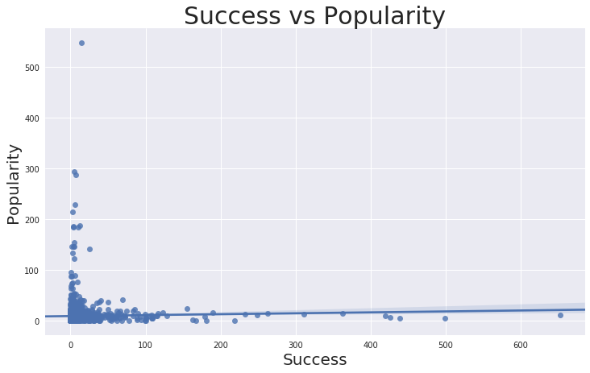
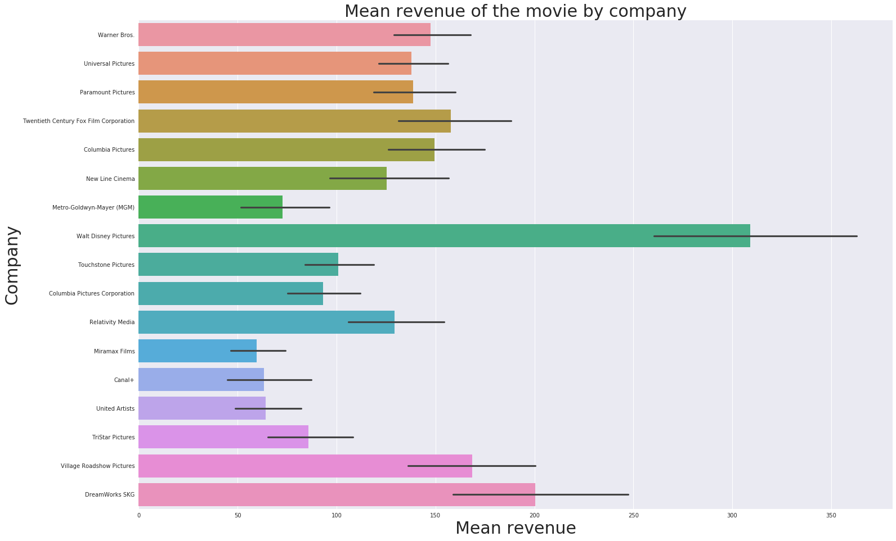
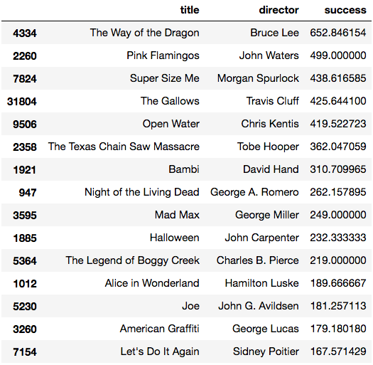

# Moneyball for Hollywood

## Problem Statement  
  
How to recognize a financially successful movie at the very starting point of its production process by analyzing existing data, using NLP models on keywords from the plot, taglines, cast and crew, as well as entire movie scripts.   
In this project, I focused on finding the answer to the question that every moviemaker-producer-investor asks themselves: "Should I start working on this movie or choose another one? Will this project be profitable to me and my partners (company)?"  
  
I used several data sets, and most advanced NLP models, combined with my experience as an actor and scriptwriter.  

## Gathering Data  
  
First [Data set](../Data/movies_metadata.csv) of about 45,000 movies with metadata was collected by [Rounak Banik](https://www.kaggle.com/rounakbanik) from TMDB.  The dataset consists of movies released on or before July 2017. Data points include cast, crew, plot keywords, budget, revenue, posters, release dates, languages, production companies, countries, TMDB vote counts and vote averages.  
This dataset consists of the following files:  

movies_metadata.csv: The main Movies Metadata file. Contains information on 45,000 movies featured in the Full MovieLens dataset. Features include posters, backdrops, budget, revenue, release dates, languages, production countries and companies.  

keywords.csv: Contains the movie plot keywords for our MovieLens movies. Available in the form of a stringified JSON Object.  

credits.csv: Consists of Cast and Crew Information for all our movies. Available in the form of a stringified JSON Object.  
  
I merged [movies_metadata.csv](./Data/movies_metadata.csv), [keywords.csv](./Data/keywords.csv) and [credits.csv](./Data/credits.csv) for EDA and visualizations.  
This data set required some cleaning. Shifted rows, wrong types of the columns, duplicated rows. Also, I  dropped some columns that look unnecessary to me considering the goal.    
Genres, production_companies, production_countries, spoken_languages, cast and crew are the stringified JSON Objects. I extracted needed information out of it in EDA notebook and saved it as [Clean_Dataset](./Data/Clean_movies.csv).  
  
For NLP modeling I used [Clean_Dataset](./Data/Clean_movies.csv) and again extracted the information out of genres, production_companies, production_countries, spoken_languages, cast and crew, but in a different way, so it was more appropriate for modeling.  

  
### Data dictionary for Clean_movies dataset  
  
|Feature|Type|Description|
|---|---|---| 
|**belongs_to_collection**|*int*|Binary column that indicates if the movie belongs to collection|
|**budget**|*float*|The budget of the movie in dollars|
|**genres**|*object*|A list of all the genres associated with the movie|
|**homepage**|*int*|Binary column that indicates if the movie has a homepage|
|**overview**|*object*|A brief overview of the movie|
|**popularity**|*float*|The Popularity Score assigned by TMDB|
|**production_companies**|*object*|A list of production companies involved with the making of the movie|
|**production_countries**|*object*|A list of countries where the movie was shot|
|**release_date**|*datetime*|Release Date of the movie|
|**revenue**|*float*|The total revenue of the movie in US dollars|
|**runtime**|*float*|Duration of the movie in minutes|
|**spoken_languages**|*object*|A list of spoken languages in the movie|  
|**tagline**|*object*|The tagline of the movie|  
|**title**|*object*|The Official Title of the movie|  
|**vote_average**|*float*|The average voting rating of the movie, as counted by TMDB|  
|**vote_count**|*float*|The number of votes, as counted by TMDB|  
|**keywords**|*object*|The movie plot keywords|  
|**cast**|*object*|Names of the cast of the movie|  
|**crew**|*object*|Names of the crew of the movie|  
  
Second [Data set](./Data/Script_budget.csv) of the [movie scripts](https://www.imsdb.com/all%20scripts/) from www.imsdb.com in form of 1093 .txt files, it's [budgets and revenues](./Data/Budgets_5686 - Budgets.csv) from www.the-numbers.com/movie/budgets in combination with budgets and revenues from [metadata set]('./Data/movies_metadata.csv'), I created myself.  
  
After the cleaning, creating a title column, dropping missing values and changing columns types I merged two sets with budget values and then merged it all with scripts data set. After merging on the 'title' column I got a dataset of scripts, titles, budgets and revenues for 642 movies and saved it as [Script_budget](./Data/Script_budget.csv) dataset.  
  
### Data dictionary for Script_budget dataset  
  
|Feature|Type|Description|
|---|---|---| 
|**script**|*object*|Entire movie script|
|**title**|*object*|The Official Title of the movie|
|**budget**|*float*|The budget of the movie in US dollars|
|**revenue**|*float*|The total revenue of the movie in US dollars|  
  
# EDA and Visualization  
  
The main goal of this project is to predict the financial success of the movie, so I explored everything related to it.
  
First I determined what is financially successful movie.     

A movie is financially successful when it's creators earn a profit after all expenses. The formula is: 

Profit = Cumulative Worldwide Gross (from movie theatres, DVDs, TV, Video Stream services, etc.) minus Budget (actual spend to produce the movie), minus Releasing Expenses (marketing, advertising, sales taxes, theatres-DVDs-TV-VideoStreamServices's share, distributor’s fee, sales agents costs etc.)

Releasing Expenses usualy equal to the Budget itself.
  
### NB! It is a very rough and generalized estimate of the Releasing Expenses, that can change drastically from case to case.

I subtracted Releasing Expenses (equal to the budget) from the Gross and divided the answer by Budget, to count how many "budgets" creators get back as a profit. 

The formula is:  
  
  ### (Gross - Release_expenses) / Budget
  
Then I created a binary column, that indicates if the movie made any profit or not and called it success_binary.  
  
The mean of this column showed that out of 5347 observations the balance between successful movies and not successful is 51% vs 49% respectively.  

After look at the heatmap I concluded that the amount of budgets that could be earned back do not correlate with any features. Whether profit will be seen at all - slightly correlated with belonging to a collection. I ignored any correlation between revenue and vote_count, because votecount is a feature that occurs after the release of the movie. I then continued to explore this dataset deeper before any models and/or conclusions were made.
  
  
  
  
## Exploring Budgets, Revenues and Success (how many budgets returned)   
  
I translated all budgets and revenues into millions by dividing it by 1,000,000, so it is easier to read.
Most of the movies have a budget of less than $40 million.  
Mean budget: 31.57956670918269   
Median budget: 17.5  
Most of the movies have revenue of less than $50 million.   
Mean revenue: 91.6441508616048   
Median revenue: 31.0  
Success looks very skewed because of some lucky outliers. The mean amount of budgets that returned: 7.463618496726632. The number is high because of a few lucky outliers.   
Median of the number of budgets that returned: 1.0679714666666666  
Max amount of budgets that returned: 12889.386666666667  
  
#### Mean success looks skewed because of outliers, but median success shows that mutual profit for 5347 movies on this particular dataset is 0.068 %. This makes sense, while there are 51 % of successful movies and 49 % of not successful
  
  
  
  
For further exploration I created the budget rating column, so the position of each movie in the "budget rating list" can easily be seen.  
  
  
  
#### After exploring different combinations of low and high budgets/revenues/success we learned, that the movies with extremely high budget usually brings profit equal to 1-3 of its budgets, which is a good result. At the same time, some of them lose money, which is awful considering their  100+ million budgets.    
#### Most successful movies have a very small budget up to 100k, their profit is not that big in actual dollars but ROI is fantastic in many cases.
#### However, IMHO, the best balance between budgets, revenue, success and the actual amount of money made is showed by movies with 1 - 10 million budget.  
  
## Exploring popularity
  
Most of the popularity rating points concentrated between 1 and 25 points.  
I compared the most popular movies (according to TMDB) with its budgets, revenues, and success  
  
   
  
  
  
  
  
#### Despite the fact that the most popular movies have made profit, they are not even close to the most profitable ones. Most of them have a very high budget, which means they have a very expensive advertising campaign that makes them popular. The only exception is "Pulp Fiction", which is definitely an exceptional movie itself.
  
### I compared movies with the biggest amount of votes (according to TMDB) with its budgets, revenues, and success.   
  
  
  
  
  
### I compared movies with the highest average of votes (according to TMDB) with it budgets, revenues and success  
The mean of the average vote is 6.3  

  

  

#### The high vote rating has nothing to do with the budget. Movies with high vote ratings are not always financially successful, like any other kind of high art, that only prepared recipient will consume. To draw some parallels I can compare it with the restaurants business: Sophisticated high-class steak house might be less profitable than a fast-food chain. Or "Ford company" 178 times more profitable than Aston Martin with all due respect to them both.
  
### Correlation between belongings to the collection (or series of the movies) and its budgets, revenues, and success.  

  

  

#### 23% of the movies in this dataset belongs to a collection
#### And they generate the same amount of profit that other 73%
#### Belonging to the collection correlated with budget and revenue, and it makes total sense. Once some movie made a profit, it's creators want to repeat the success, once the plot allows it. They already checked that that specific combination of story, characters and actors works well and people like it enough to pay for that and waiting for more, so it makes the investments into the new part of the same movie less risky. Even though sequels sometimes are not that good as the original movie - they still generating some profit.¶
#### I believe that some collections were planned in advance or original movies had an open end on purpose, so there is a possibility for the sequel. And some movies got a continuation just because the original one became very profitable (Paranormal Activity, Saw). The great example of opening the possibility for the sequel was showed by the movie "Rambo: First Blood". In the original novel "First Blood" by David Morrell John Rambo died. But moviemakers made him survived for a few more movies, that brought profit.
  
### Comparison of the movies with a homepage and its budgets, revenues and success  

  
  
  
  
#### Having homepage correlated with everything, especially nowadays. It is not one of the most important components of success, but it is helpful.
  
### Exploration of a release date.  
#### To explore the release date of the movies, I created one more column called 'month'.  
  
  
  
  
  
  
  
#### Big amount of the movies was released in September, they have a low budget and small sum of revenue, but overall they are very successful.
#### Second big amount of the movies was released in May and June, with the biggest budget and biggest revenue.
#### Finally the third cluster was found around December, with mid-high budgets and very good revenues.  
  
### Movies by day  
#### I created one more column called 'weekday'.  
  
  
  
  
  
  
  
#### Most of the movies were released by Friday, so people can go and see them on the weekend. But also the most expensive movies that generate more profit were released by Tuesday and Wednesday.
  
### Exploration of a genres. 
#### Some of the movies contain few genres, so I used them all. I used the stack() method for that.  
  
  
  
#### Drama is the most popular genre. And comedy is the second popular. Probably because it is easier to make people cry than laugh.
  
  
  
  
  
  
  
  
  
#### The most expensive movies that generates the biggest amount of money is animation, adventure, sci-fi, action and family movies with advanced special effects and most expensive actors. The most successful movies are low budget horror and mysteries. In general, every genre generating the amount of money that equally proportional to its budget. There are no bad or good genres. All of them are in demand.  
  
### Production companies, actors and directors.  
  
  
  
  
  
  
  
  
  
#### Most successful movies of the "United Artists Company"  
  
  
  
#### Amount of the movies made by the company doesn't tell anything, but the age of the company. Walt Disney has the highest mean budgets and revenues making animations and fantasies. With a relatively small amount of the movies, Dream Works having high budget and revenues (probably because it was founded by Steven Spielberg and he, being one of the most successful directors of all times, makes most of the movies). But most profitable if United Artists and New Line Cinema with low and mid-budget movies.
  
### Actors   
  
  
  
  
  
  
  
  
  
#### Correlation between mean budget and mean revenue is obvious for almost every actor. Most of them playing the same type of the characters in the movies based on the same type of the story. I'll explain later about types of stories.
#### Significant success showed by Harrison Ford and Sylvester Stallone, because of the legendary movies they played back in a day, with low budgets and tremendously high revenue (Rocky, Rambo, Indiana Jones and of course Star Wars!). 
#### More deep detailed analysis can be done about each actor to categorize them by the type and also by return they generate for 1 dollar spent on their fee as a lead. 
  
### Directors  
  
  
  
  
  
  
  
  
  
#### Directors of the most successful movies  
  
  
  
#### Successful directors  
  
  
  
  
  
#### Amount of the movies made by the director are not correlated with its success. Steven Spielberg is the champion by all means, but Alfred Hitchcock also showed great result and I can't compare budgets and revenues of these two, because they represent completely different eras of the movie. There is a lot of brilliant directors who created tons of legendary movies, even if there was just a few of them in their career.  
  
# Modeling 
  
In my second notebook [NLP modeling](./Code/2_NLP_modeling.ipynb) I used [Clean_Dataset](./Data/Clean_movies.csv). Genres, production_companies, production_countries, cast and crew is the stringified JSON Object and/or lists. I extracted needed information out of it for modeling. 
  
I created a binary column, that indicates if the movie made any profit or not and called it success_binary, using this formula again: (Gross - Release_expenses) / Budget 
  
After dropping all missing values I had 4588 observations eligible for modeling and extracted the rest of the info from the lists and JSON objects, that I wasn't able to extract before, so I can use all necessary columns. ???????
  
As a features for modeling I chose 'title', 'overview', 'tagline', 'director', 'cast1', 'genres1', 'keywords1', 'production_companies1' and 'crew1' columns. 
  
First I tried CountVectorizer but because this amount of data would take forever to proceed with my current computational power, I used TruncatedSVD to reduce it. 
  
Then I tried logistic regression, KFold and RandomForestClassifier. 
  
Then I tried GridSearch with KNeighborsClassifier and VoringClassifier with AdaBoostClassifier and GradientBoostingClassifier. 
  
Testing score for all these models was between 47 and 58, so I repeated all this process using TF-IDF Vectorizer. 
  
After trying many different combinations of parameters for all these models the best score was around 0.6233. 
  
There is still a big room for experiments, with different combinations of features, stop-words and parameters. Also, I think that creating dataset of ratings of actors and directors and even other members of the crew will help a lot.  
  
In my third notebook [Scripts_&_budgets](./Code/3_NLP_Scripts.ipynb) I used [Data set](./Data/Script_budget.csv) of the [movie scripts](https://www.imsdb.com/all%20scripts/) from www.imsdb.com in form of 1093 .txt files, it's [budgets and revenues](./Data/Budgets_5686 - Budgets.csv) from www.the-numbers.com/movie/budgets in combination with budgets and revenues from [metadata set](./Data/movies_metadata.csv) that I already used in previous two notebooks. 
  
I cleaned it, renamed columns and replaced some zeros in 'budget' and 'revenue' columns with NaNs.
Then I got all movie scripts and put them in the dataset. Also got the titles and cleaned them properly. 
  
And then, after merging all three datasets on the 'title' column I got 642 observation with no missing data. Saved as [Scripts_budget](./Data/Script_budget.csv). 
  
Before starting modeling I AGAIN created a binary column, that indicates if the movie made any profit or not and called it success_binary using this formula: (Gross - Release_expenses) / Budget 
  
Benchmark was 0.615.  
I assigned target and combined scripts with titles into one column. 
  
Then I used CountVectorizer with logistic regression, KFold and RandomForestClassifier. And GridSearch with KNeighborsClassifier and VoringClassifier with AdaBoostClassifier and GradientBoostingClassifier. 
  
Unfortunately, none of these models showed any promising results. Logistic regression with KFold split showed the highest 0.645 cross-validation score, but this result is not successful, considering 0.615 benchmark. 
  
Then I used the most advanced NLP technique - DOCtoVEC.  
  
This technique I learned from Data Scientist Susan Li, from her post [Multi-Class Text Classification with Doc2Vec & Logistic Regression](https://towardsdatascience.com/multi-class-text-classification-with-doc2vec-logistic-regression-9da9947b43f4), with huge appreciation and gratitude.
  
First I prepared the data. Splited everything into separate words, cleaned unnecessary symbols, changed everything to the lower case and eventually got 51+ millions of words. 
  
Then used train/test split, removed stop-words and tokenized text using NLTK tokenizer for text data and target, for training and testing set. 
  
For this model, I needed all my computational power and I made sure that I use all my worker threads to train the model by using multiprocessing.cpu_count(). 
  
First I tried Distributed Bag of Words (DBOW) and Logistic Regression. 
  
Then repeated this process with Distributed Memory using 300 dimensions and 30 epochs. 
  
The result is equal to the benchmark.
  
According to [Gensim doc2vec tutorial on the IMDB sentiment data set](https://github.com/RaRe-Technologies/gensim/blob/37bc8d45f5b1a5b702e70e3f48d8073508ee22b1/docs/notebooks/doc2vec-IMDB.ipynb), combining a paragraph vector from Distributed Bag of Words (DBOW) and Distributed Memory (DM) improves performance. I tried that and result was also not seccessful.
  
I tried different parameters and run the loops.
The best testing result was 0.668394 for DBOW and 0.616580 for DM. 
  
After that I ran both models again with the best parameters and then combined a paragraph vector from both of them. 
  
The testing score is 0.5699, lower than the benchmark.   
    
  
# Executive Summary

None of the most advanced models I used were able to identify any patterns for predicting financial success with such a thin matter as the art of writing the movie script. There is still a big room for experiments, with different combinations of features, stop-words, and parameters. Mining more data, having a team of people and much more computational power, having some linguists and writers on the team definitely will help. 
  
There might be separate models for each genre, to find the pattern in the scripts of the same type. 
  
Another possible experiment - to create a dataset with movie scripts, divided not by the genre as we used to know them, but by the story types, and there is 10 of them according to [Blake Snyder](http://www.savethecat.com/). Divided by what exactly going on with the main character and how he changes during the movie.
Short example: Die Hard, Schindler's List and Terminator is the same type of story, even it is completely different genres. Blake Snyder calls this type - "Dude with a problem". It consists of an INNOCENT HERO, SUDDEN EVENT and LIFE OR DEATH BATTLE. Absolutely ordinary person (policeman, director of the factory in Poland or waiter in the diner) got into absolutely extraordinary situation - terrorists capture the building, nazis dragging Jewish friends to extermination camp or robot from the future (with accent!) trying to kill her and her unborn (and not even conceived yet) child!
  
So the scripts might be divided by the story types and then processed through the models. Than extracting just a verbs will helps to determine what's going on with the main character. And if this character's type belongs to this story's type, then we will be able to say that this movie will be successful. And if you will remember a lot of successful movies with most successful actors - their types match the types of stories they play. 
  
Also, patterns might be found while exploring the structures of the plots. Most successful movie's plots matching with "the perfect structure" with 3 main parts and other important bits. Back in a day I did some analysis about that matter and found that most of the successful movies do that. And the champion of this "matching" is Steven Spielberg, one of the most successful directors ever. 
  
Again this is just a theory, that requires a lot of men/hours and computational power to be proved or disproved. 
  
I will gladly continue my research in this direction, because the fruit at the end is priceless, especially for movie and data enthusiasts like myself in particular and moviemakers in general. 
As for now we still can learn a lot from the old good exploratory analysis and visualizations.
  
In the first notebook with EDA, I found that all the movies might be divided by 3 huge clusters. 
  
First one contains super-expensive blockbusters, animations, adventures, fantasy, sci-fi and family movies in general. Mostly been shot by the same companies, same directors with the same actors and released right before or at the beginning of the summer, so all kids and their young parents can enjoy it. They generating the biggest revenues of all times that might be compared with the GDP of come countries. And they definitely worth it. But usually this revenues equal to just a few of its budgets, which is still a tremendous amount of money, but the risks are high too. 
  
The second cluster contains mid-budget movies - dramas, comedies, actions, and historical films, made by directors that already proved themselves, with a good and expensive cast, released near the autumn or December, probably closer to awards ceremonies. Because a lot of them definitely represents a high artistic value. Most of the legendary movies we know, that survived decades and still fascinates hundreds of millions of people is belong to that cluster. They accumulate very high revenues and have the perfect balance between budgets, revenues and amounts of the budgets that returned to their creators. But they still risky for investors, because art is very unpredictable and subjective. 
  
Finally, the third cluster contains low-budget horrors (mostly), mysteries and even dramas, that were written by unknown writers, shot by unknown directors with unknown actors (and sometimes it is the same person) with unknown devices (even smartphones this day). But because their budgets are so low, their success sometimes makes very jealous even those, who sold their bitcoins in December of 2017. The best examples are "Paranormal Activity" and "The Blair Witch Project", with 15k or 60k budgets and 200+ millions of dollars revenue. With no special effects and interesting twisted plots, these movies serve as a great springboard for everyone, who took part in its creation. 
  
Usually, creators (writers, directors, producers and actors) of successful low budget movies demonstrate perfect transition through this clusters, from third to the first one. My favorite examples of such transitions are Sylvester Stallone, Matt Damon, Harrison Ford, Arnold Schwarzenegger, etc. I would like to bring a visual example of it, based on the numbers: 
  
#### James Cameron 
  
 
  
#### Darren Aronofsky 
  
 
  
With this being said I wish each and everyone who involved into the process of the creation of the movies - inspiration and courage on their not easy path of bringing joy and happiness, excitement and inspiration to the people all over the world.
  
  
P.S. And don't forget to make sure that your story will have a continuation in order to be part of the collection... 
  
P.P.S. And of course make a homepage for your movie! 
  
  
                                                                                    to be continued...
