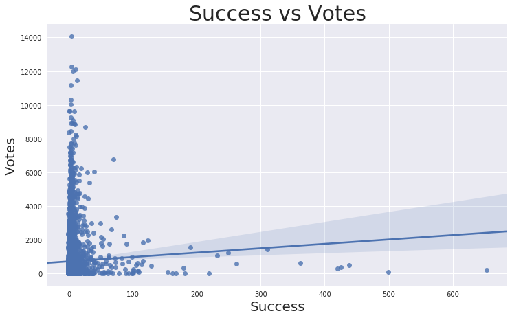

# Moneyball for Hollywood

## Problem Statement  
  
How to recognize financially successful movie at the very starting point of it's production process by analyzing existing data, using NLP models on keywords from the plots, taglines, cast and crew, as well as entire movie scripts.   
In this project I worked on finding the answer for the question, that every moviemaker-producer-investor asks himself: "Should I start working on this movie or choose another one? Will this one brings some profit to me and my partners(company)?"  
  
I have used few data sets, several most advanced NLP models, my experience as actor and scriptwriter in combination with common sense.  

## Gathering Data  
  
First [Data set](./Data/movies_metadata.csv) of about 45000 movies with metadata was collected by [Rounak Banik](https://www.kaggle.com/rounakbanik) from TMDB. These files contain metadata for all 45,000 movies listed in the Full MovieLens Dataset. The dataset consists of movies released on or before July 2017. Data points include cast, crew, plot keywords, budget, revenue, posters, release dates, languages, production companies, countries, TMDB vote counts and vote averages.   
This dataset consists of the following files:  
  
movies_metadata.csv: The main Movies Metadata file. Contains information on 45,000 movies featured in the Full MovieLens dataset. Features include posters, backdrops, budget, revenue, release dates, languages, production countries and companies.  
  
keywords.csv: Contains the movie plot keywords for our MovieLens movies. Available in the form of a stringified JSON Object.  
  
credits.csv: Consists of Cast and Crew Information for all our movies. Available in the form of a stringified JSON Object.  
  
I merged [movies_metadata.csv](./Data/movies_metadata.csv), [keywords.csv](./Data/keywords.csv) and [credits.csv](./Data/credits.csv) for our EDA and vizualizations.  
This data set required some cleaning. Shifted rows, wrong types of the columns, duplicated rows. Also I  dropped some columns that look unnessesary to me considering our goal.    
Genres, production_companies, production_countries, spoken_languages, cast and crew is the stringified JSON Object. I extracted the information out of it in EDA notebook based on our needs and saved is as [Clean_Dataset](./Data/Clean_movies.csv).  
  
For NLP modeling I used [Clean_Dataset](./Data/Clean_movies.csv) and again extracted the information out of genres, production_companies, production_countries, spoken_languages, cast and crew, but in a different way, so it was more appropriate for modeling.  
  
### Data dictionary for Clean_movies dataset  
  
|Feature|Type|Description|
|---|---|---| 
|**belongs_to_collection**|*int*|Binary column that indicates if the movie belongs to collection|
|**budget**|*float*|The budget of the movie in dollars|
|**genres**|*object*|A list of all the genres associated with the movie|
|**homepage**|*int*|Binary column that indicates if the movie has a homepage|
|**overview**|*object*|A brief overview of the movie|
|**popularity**|*float*|The Popularity Score assigned by TMDB|
|**production_companies**|*object*|A list of production companies involved with the making of the movie|
|**production_countries**|*object*|A list of countries where the movie was shot|
|**release_date**|*datetime*|Release Date of the movie|
|**revenue**|*float*|The total revenue of the movie in US dollars|
|**runtime**|*float*|Duration of the movie in minutes|
|**spoken_languages**|*object*|A list of spoken languages in the movie|  
|**tagline**|*object*|The tagline of the movie|  
|**title**|*object*|The Official Title of the movie|  
|**vote_average**|*float*|The average voting rating of the movie, as counted by TMDB|  
|**vote_count**|*float*|The number of votes, as counted by TMDB|  
|**keywords**|*object*|The movie plot keywords|  
|**cast**|*object*|Names of the cast of the movie|  
|**crew**|*object*|Names of the crew of the movie|  
  
Second [Data set](./Data/Script_budget.csv) of the [movie scripts](https://www.imsdb.com/all%20scripts/) from www.imsdb.com in form of 1093 .txt files, it's [budgets and revenues](./Data/Budgets_5686 - Budgets.csv) from www.the-numbers.com/movie/budgets in combination with budgets and revenues from [metadata set]('./Data/movies_metadata.csv'), I created myself.  
After the cleaning, creating title column, dropping missing values and changing columns types I merged two sets with budget values and then merged it all with scripts data set. After merging on the 'title' column I got dataset of scripts, titles, budgets and revenues for 642 movies and saved it as [Script_budget](./Data/Script_budget.csv) dataset.  
  
### Data dictionary for Script_budget dataset  
  
|Feature|Type|Description|
|---|---|---| 
|**script**|*object*|Entire movie script|
|**title**|*object*|The Official Title of the movie|
|**budget**|*float*|The budget of the movie in dollars|
|**revenue**|*float*|The total revenue of the movie in US dollars|  
  
# EDA and Visualization  
  
Because the main goal of this project is to predict financial success of the movie, I explored and explained everything that related to it.  
  
First I determined what is it exactly - financially successful movie.  
  
Financially successful movie is the movie, whose creators (filmmakers) get some profit out of this movie. According to my experience and knowledge, as well to some movie produccers I've met in Hollywood and New York, very rough formula for detecting creator's profit is:  
  
Cumulative Worldwide Gross (from movie theatres, DVDs, TV, Video Stream services, etc.) minus Budget (actual spends to produce the movie) minus Releasing Expences (marketing, advertising, sales taxes, theatres-DVDs-TV-VideoStreamServices's share, distributor’s fee, sales agents costs etc.). So if you are lucky enough your Releasing Expences will be around your Movie Budget.  
  
### NB! It is very rough and generalized estimate of the Releasing Expences, that can change drastically from case to case.  
I will subtract Releasing Expences (equal to the budget) from the Gross first and then will count how many budgets creators get back.  
  
### NB! Again, it is still very rough and generalized formula . It is possible to make it more sofisticated and percise once I will have access to all the numbers related to Releasing Expences in each individual case, and of course THE REAL budget, before it's adjastments for IRS, if such action had have a place.  
So for now the formula is:  
  
### (Gross - Release_expenses) / Budget  
  
Then I created a binary column, that indicates if the movie made any profit or not and called it success_binary.  
The mean of this column showed us that the ballance between successful movies and not successful out of 5347 observations is 51% vs 49% respectively.  
Exploring the correlation between numerical columns showed us very interesting results. Amount of budgets you are going to make or lose doesn't correlate with anything... Will you make any money or will lose - slightly correlated with it's belonging to collection. I wouldn't consider it's correlation with revenue and vote_count, because those features is actually aftermath.  
  
  
  
  
#### Exploring Budgets, Revenues and Success (how many budgets returned)   
  
I've translated all budgets and revenues into millions by dividing it by 1.000.000, so it will be easier for us to read.  
Most of the movies has a budget less than $40 millions.  
Mean budget: 31.57956670918269   
Median budget: 17.5  
Most of the movies has the revenue less than $50 millions.   
Mean revenue: 91.6441508616048   
Median revenue: 31.0  
Success looks very skewed because of some lucky outliers. Mean of amout of budgets that returned: 7.463618496726632. The number is high because of few lucky outliers.   
Median of amout of budgets that returned: 1.0679714666666666  
Max amout of budgets that returned: 12889.386666666667  
  
#### Mean success looks skewed because of outliers, but median success shows us that mutual profit for 5347 movies we have here is 0.068 %. This is makes sense, while we know that we have 51 % of successful movies and 49 % of not successful.    
  
  
  
  
For further exploration I created the budget raiting column, so we can easily see the position of each movie in the "budget raiting list".  
  
  
  
#### After exploring different combinations of low and high budgets/revenues/success we learned, that the movies with extremely high budget usualy brings profit equal to 1-3 of it's budgets, which is a good result. At the same time some of them lose money, which is awful considering their  100+ millions budgets.    
#### Most successful movies have a very small budgets up to 100k, their profit is not that big in actual dollars but even if they are losing money - their lost is not equal to the GDP of some countries.    
#### However, IMHO, the best balance between budgets, revenue, success and actual amout of money made is showed by movies with 1 - 10 millions budget.  
  
### Exploring popularity  
  
Most of the popularity raiting points concentrated between 1 and 25 points.  
I compared the most popular movies (according to TMDB) with it's budgets, revenues and success  
  
   
  
  
  
  
  
### Eventhough the most popular movies have made some profit, they are not even close to the most profitable ones. Most of them have very high budget, which means they have very expenive advertisement compaign that makes them popular. The only exeption probably is "Pulp Fiction", which is defenitely the exeptional movie by itself.  
  
### I compared movies with the biggest amount of votes (according to TMDB) with it's budgets, revenues and success.   
  
  
  
  
  
#### Looks like the same picture as we saw with popularity  
  
### I compared movies with the highest average of votes (according to TMDB) with it's budgets, revenues and success  
The mean of average vote is 6.3  

  

  

#### We can see that high vote raiting has nothing to do with budget. Movies with high vote raiting not always even financially successful, like any kind of high art, that only prepared recipient will consume. To draw some parallels I can compare it with the restaurants business: Sofisticated high-class steak house might be less profitable than fast-food chain. Or "Ford company" 178 times more profitable than Aston Martin with all due respect to them both.  
  
### Let's see how belongings to the collection correlated with budgets, revenues and success  

  

  

#### 23% of the movies we have in our dataset is belong to collection  
#### And they genereting the same amout of profit that other 73%  
#### Belonging to the collection correlated with budget and revenue, and it makes total sense. Once some movie made a profit, it's creators want to repeat the success, once the plot allows it. They already checked that that specific combination of story, characters and actors works well and people like it enough to pay for that and waiting for more, so it makes the investments in to the new part of the same movie less risky. Eventhough sequels sometimes is not that good as original movie - they still generating some profit.    
  
#### I believe that some collections was planned in advance or original movies had an open end on purpose, so there is a possibility for the siquel. And some movies got a continuation just because the original one became very profitable (Paranormal Activity, Saw). Great example of opening the possibility for sequel was showed by the movie "Rambo: First Blood". In the original novel "First Blood" by David Morrell John Rambo died. But moviemakers made him survived for few more movies, that brought some profit.    
  
### Let's see how having a homepage correlated with budgets, revenues and success  

  
  
  
  
#### Obviously having homepage correlated with everything, especially nowadays. It is not one of the most important component of the success, but it is helpful.    
  
### Time and money. Let's explore release date.  
In order to explore the release date of the movies I created one more column called 'month'.  
  
  
  
  
  
  
  
#### We can see the big amout of the movies was released in September, they have a low budget and small sum of revenue, but overall they are very successful  
#### Second big amout of the movies was released in May and June, with the biggest budget and biggest revenue.  
#### Finally third claster we can see around December, with mid-high budgets and very good revenues.  
  
### Movies by day  
Also I created one more column called 'weekday'.  
  
  
  
  
  
  
  
#### Most of the movies was released by Friday, so people will go and see them on weekend, which makes total sense. But also most expensive movies that generates more profit was released by Tuesday an Wednesday.  
  
### Let's explore genres  
Some of the movies contain few genres, so I will use them all. I used the stack() method for that.  
  
  
  
#### Drama is the most popular genre. And comedy is the second popular. Probably because it is easier to make people cry, than laugh  
  
  
  
  
  
  
  
  
  
#### As we can see, the most expencive movies that generate the biggest amout of money is animation, anventure, sci-fi, action and family movies with all advanced special effects and most expensive actors. and most successful movie is low budget horros and mysteries. In general every genre generating amout of money that equaly proportional to it's budget. There is no bad or good genres. All of them is in demand.  
  
### Production companies, actor and directors.  
  
  
  
  
  
  
  
  
  
Most successful movies of the "United Artists Company"  
  
1[image](./Visualizations/united_sucs.png)  
  
#### Amout of the movies made by the company doesn't tell us anything, but the age of the company. Walt Disney have a highest mean budgets and revenues making animations and fantasies. With relatively small amout of the movies, Dream Works having high budget and revenues (probably because it was founded by Steven Spielberg and he, being one of the most successful director of all times, makes most of the movies). But most profitable if United Artists and New Line Cinema with low and mid-budget movies.  
  
### Actors   
  
  
  
  
  
  
  
  
  
#### Correlation between mean budget and mean revenue is obvious for almost each actor. Most of them playing the same type of the characters in the movies based on the same type of the story. About types of the stories I'll explain later.  
  
#### Significant success showed by Harrison Ford and Sylvester Stallone, because of the legendary movies they played back in a days, with low budgets and tremendously high revenue (Rocky, Rambo, Indiana Jones and of course Star Wars!).  
  
#### More deep detailed analysis can be done about each and every actor in order to categorized them by the type and also by return they generate for 1 dollar spent on their fee as a lead.  
  
### Directors  
  
  
  
  
  
  
  
  
  
Directors of the most successful movies  
  
  
  
Successful directors  
  
  
  
  
  
#### Amout of the movies made by director has nothing to do with it's success. Steven Spielberg is the champion by all means, but Alfred Hitchcock also showed great result and we can't compare budgets and revenues of this two, because they represent completely different eras of the movie. There is a lot of brilliant directors who created tons of legendary movies, even if there was just few of them in their career.  
  
# Modeling  
  
In my second notebook [NLP modeling](./Code/2_NLP_modeling.ipynb) I used [Clean_Dataset](./Data/Clean_movies.csv). Genres, production_companies, production_countries, cast and crew is the stringified JSON Object and/or lists. I  extracted the information we need for modeling out of it.  
  
I created a binary column, that indicates if the movie made any profit or not and called it success_binary again by this formula: (Gross - Release_expenses) / Budget  
  
After dropping all missing values I had 4588 observations eligible for modeling and extracted the rest of the info from the lists and JSON objects, that I wasn't able to extract before, so I can use all nessesary columns.  
  
As a features for modeling I chose 'title', 'overview', 'tagline', 'director', 'cast1', 'genres1', 'keywords1', 'production_companies1' and 'crew1' columns.  
  
First I tried CountVectorizer but because this amout of data would takes forever to proceed with my current computational power, I used TruncatedSVD in order to reduce it.  
Then I tried logistic regression, KFold and RandomForestClassifier.  
This results didn't make us happy, so let's try GridSearch with KNeighborsClassifier and VoringClassifier with AdaBoostClassifier and GradientBoostingClassifier.  
Testing score for all this models was between 47 and 58, so I repeated all this process using TF-IDF Vectorizer.  
After trying many different combinations of parameters for all this models the best score was around 0.6233.  
  
#### There is still a big room for experiments, with different combinations of features, stop-words and parameters. Also I think that creating dataset of raitings of actors and directors and even other members of the crew will help a lot.   
  
In my third notebook [Scripts_&_budgets](./Code/3_NLP_Scripts.ipynb) I used [Data set](./Data/Script_budget.csv) of the [movie scripts](https://www.imsdb.com/all%20scripts/) from www.imsdb.com in form of 1093 .txt files, it's [budgets and revenues](./Data/Budgets_5686 - Budgets.csv) from www.the-numbers.com/movie/budgets in combination with budgets and revenues from [metadata set](./Data/movies_metadata.csv) that I already used in previous two notebooks.  
Needed to clean it, rename columns and replace some zeros in 'budget' and 'revenue' columns.  
Than got all movie scripts and put them in the dataset. Also got the titles and clean them properly.  
  
And then, after merging all three with each other on the 'title' column I got 642 observation with no missing data. Saved as [Scripts_budget](./Data/Script_budget.csv).  
  
Before starting modeling I AGAIN created a binary column, that indicates if the movie made any profit or not and called it success_binary again by this formula: (Gross - Release_expenses) / Budget  
  
Benchmark was 0.615.   
I assigned our target and combine scripts with titles into one column.  
  
Then again I used CountVectorizer with logistic regression, KFold and RandomForestClassifier. And GridSearch with KNeighborsClassifier and VoringClassifier with AdaBoostClassifier and GradientBoostingClassifier.  
Unfortunaly none of this models showed any promising results. Logistic regression with KFold split showed the highes 0.645 cross validation score, but it is not the result we want, considering our 0.615 benchmark.  
  
### And then I decided to use the most advanced NLP technique - DOCtoVEC.   
  
#### This techniques I learned from incredible Data Scientist Susan Li, from her post [Multi-Class Text Classification with Doc2Vec & Logistic Regression](https://towardsdatascience.com/multi-class-text-classification-with-doc2vec-logistic-regression-9da9947b43f4), with huge appreciation and gratitude.
  
First I prepared the data. Split everything into separate words, clean unnecessary symbols and bring everything to the lower case and eventually got 51+ millions of words.  
Then used train/test split, removed stop-words and tokenized text using NLTK tokenizer for text data and target, for training and testing set.  
For this kind of model I needed all my computational power and I made sure that I use all my worker threads to train the model by using multiprocessing.cpu_count().  
First I tried Distributed Bag of Words (DBOW) and Logistic Regression.  
Then repeated this process with Distributed Memory using 300 dimensions and 30 epochs.  
And got the result that is equal to our benchmark...  
But! According to Gensim doc2vec tutorial on the IMDB sentiment data set, combining a paragraph vector from Distributed Bag of Words (DBOW) and Distributed Memory (DM) improves performance. And that's exactly what I did. This result is also doesn't makes us happy. Let's try and play with different parameters.
So I tried and played with different parameters and run the loops, that was working days and nights.
The best testing result was 0.668394 for DBOW and 0.616580 for DM.  
The last hope was to run both models again with best parameters and then combining a paragraph vector from both of them.  
Testing score is 0.5699, even lower than benchmark.  
  
# Executive Summary  
  
None of the most advanced models I used were able to identify any paterns for predicting funancial success with such a thin metter as the art of writing the movie script. As I said before there is still a big room for experiments, with different combinations of features, stop-words and parameters. Mining more data, having a team of people and much more computational power, having some linguists and writers on the team definitely might helps.  
  
There might be separate models for each genre, to find the pattern in the scripts of the same type.  
  
Or even create dataset with movie scripts, divided not by the genre as we use to know them, but by the story types, and there is 10 of them according to [Blake Snyder](http://www.savethecat.com/). Devided by what exactly going on with the main character and how he change during the movie. Short example: Die Hard, Shindler's List and Terminator is the same type of the story, even it is completely different genres. Blake Snyder calls this type - "Dude with a problem". It consist INNOCENT HERO, SUDDEN EVENT and LIFE OR DEATH BATTLE Absolutely ordinary person (police man, director of some factory in Poland or weiter in the diner) got into absolutely extraordinary situation - terrorists capture the building, nazis dragging jewish friends to extermination camp or robot from the future (with accent!) trying to kill her and her unborn (and not even conceived yet) child!  
  
So the scripts might be devided by the story types and then processed through the models. Than extracting just a verbs will helps to determing what's going on with the main character. And if this character's type belongs to this story's type, then we will be able to say that this movie will be successful. And if you will remember a lot of successful movies with most successful actors - their types totaly match the types of the stories they play.  
  
Also patterns might be found while exploring the structures of the plots. Most successful movie's plots matching with "the perfect structure" with 3 main parts and other important bits. Back in a days I did some analysis about that matter and found that most of the successful movies does that. And the champion of this "matching" is... Steven Spielberg, one of the most successful directors ever.  
  
Again this is just a theories, that requers a lot of men/hours and computational power to be proved ot disproved.  
  
I will gladly continue my research in this direction, because the fruit at the end is priceless, especially for movie and data enthusiasts like myself in particular and moviemakers in general.  
  
As for now we still can learn a lot from the old good exploratory analysis and visualizations combined with life experience, knowledge of the industry and common sense.  
  
In the first notebook with EDA I found that all the movies we explored might be devided by 3 huge clasters.  
  
First one contains super-expensive blockbusters, animations, anventures, fantasy, sci-fi and family movies in general. Mostly been shot by the same companies, same directors with the same actors and released right before or at the beginning of the summer, so all kids and their young parents can enjoy it. They generating the biggest revenues of all times that might be compare with GDP of come countries. And they definitely worth it. But usualy this revenues equal to just few of it's budgets, which is still tremendous amout of money, but the risks is high too.  
  
Second cluster contains mid-budget movies - dramas, comedies, actions and historical films, made by directors that already proved themselves, with good and expensive cast, released near the autumn or December, probably colser to awards ceremonies. Because lot of them definitely represents a high artistic value. Most of the legendary movies we know, that survived decades and still fascinates hundreds of millions people is belong to that claster. They accumulate very high revenues and I would say that they have the perfect ballance between budgets, revenues and amouts of the budgets that returns to their creators. But they still risky for investors, because art is very unpredictable and subjective.  
  
Finally the third claster contains low-budget horrors (mostly), mysteries and even dramas, that were writen by unknown writers, shot by unknow directors with unkown actors (and sometimes it is the same person) with unknown devices (even smartphones this days). But! Because their budgets is so low, their success sometimes makes very jealous even thouse, who sold their bitcoins in December of 2017. The best examples is "Paranormal activity" and "The Blair Witch Project", with 15k or 60k budgets and 200+ millions of dollars revenue! With no special effects and interesting twisted plots this movies serves as a great springboard for everyone, who taking part in it's creation.  
  
Usualy moviemakers (writers, directors, producers and actors) of successful low budget movies demonstrate perfect transition through this clasters, from third to the first one. My favorite examples of such transitions is: Sylvester Stallone, Matt Damon, Harrison Ford, Arnold Schwarzenegger of course (and not only because of accent and immigration history) and many many others. I would like to bring visual evample of it, based on the numbers:  
  
#### James Cameron  
  
  
  
  
  
#### Darren Aronofsky  
  
  
  
  
    
#### With this being said I wish each and everyone who involved into the process of the creation of the movies - inspiration and courage on their not easy path of bringing joy and happines, excitement and inspiration to the people all over the world. And I, personaly will definitely keep doing this.    
  
P.S. And don't forget to make sure that your story will have a continuation in order to be the part of collection...  
  
P.P.S. And of course make a homepage for your movie!  
  
                                                                                    to be continued...
